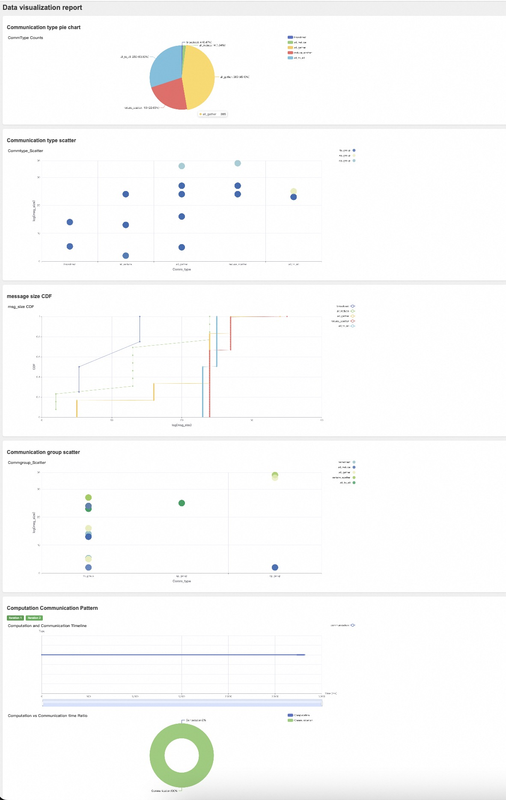

# Access AICB
You can access the full suite of **SimAI** tools on **GitHub** via  [**SimAI@github**](https://github.com/aliyun/SimAI)

You can access AICB on **GitHub** via  [**AICB@github**](https://github.com/aliyun/aicb)

You can also access AICB on **Gitee** via [**AICB@gitee**](https://gitee.com/ali-ais-hpn/aicb)

Welcome to join the SimAI community chat groups, with the DingTalk group on the left and the WeChat group on the right.

<div style="display: flex; justify-content: flex-start; align-items: center; gap: 20px; margin-left: 20px;">
    
    
</div>

<br/>

# Lastest News
[2024/9] AICB Version 1.1 Released.
This version brings the following changes:

Features
1. Added result visualization functionality, which supports displaying results after physical cluster runs and also supports visualization of generated workload files. For details, see the Readme.
2. Optimized the method for dividing communication groups, enhancing scalability.
3. Added support for the AIOB computation pattern for moe group_gemm.
Made some optimizations to the run_in_cluster script.

Bug Fixes

1. Fixed some calculation errors of BusBw in the log.
2. Fixed abnormal computation time issues with AIOB during multi-machine runs.
3. Fixed anomalies in comm_log statistics when computation_enable is on.
4. Fixed potential hangs in the `run_suite` script.
5. Fixed errors in generating simAI workload description files when using `tp=1`, `ep=1`.
6. Fixed some msg size errors related to moe.

# Table of Contents

- [Access AICB](#access-aicb)
- [Lastest News](#lastest-news)
- [Table of Contents](#table-of-contents)
- [AICB Overview](#aicb-overview)
  - [Introduction](#introduction)
  - [The benchmark suite in AICB](#the-benchmark-suite-in-aicb)
- [Setup](#setup)
- [Usage](#usage)
  - [Running on physical GPU clusters](#running-on-physical-gpu-clusters)
    - [Basic parameters that you need to set](#basic-parameters-that-you-need-to-set)
    - [Running the whole benchmark suite](#running-the-whole-benchmark-suite)
    - [Running workloads for Megatron](#running-workloads-for-megatron)
    - [Running workloads for MOE](#running-workloads-for-moe)
    - [Running workloads for DeepSpeed](#running-workloads-for-deepspeed)
    - [Embedding the compuation patterns in the workload](#embedding-the-compuation-patterns-in-the-workload)
  - [Generate Workloads for Simulation (SimAI)](#generate-workloads-for-simulation-simai)
    - [Generating the workload description files for the whole benchmark suite](#generating-the-workload-description-files-for-the-whole-benchmark-suite)
    - [Generating the workload description files for Megatron](#generating-the-workload-description-files-for-megatron)
    - [Generating the workload description files for Moe](#generating-the-workload-description-files-for-moe)
    - [Generating the workload description files for DeepSpeed](#generating-the-workload-description-files-for-deepspeed)
  - [Running AICB with customized parameters](#running-aicb-with-customized-parameters)
    - [Running customized workloads on physical GPU clusters](#running-customized-workloads-on-physical-gpu-clusters)
    - [Generating customized workload description files](#generating-customized-workload-description-files)
  - [Result Visualization](#result-visualization)
- [Tutorial](#tutorial)
- [Projects using AICB](#projects-using-aicb)

# AICB Overview
## Introduction
AICB (Artificial Intelligence Communication Benchmark), is a novel benchmark suite for evaluating the communication system of a realistic and emulated GPU cluster from the pespectives of the emerging training and inference applications. Different from exisiting network benchmarks, AICB is designed to produce the communication workloads with precise patterns that are aligned to real-world applications. Taking the Large Language Model (LLM) training as an example, the workloads vary with the complicated combinations of models, parallel frameworks, and parameters of the models, parallel frameworks, and the collective communication libraries. In general, the scenarios suitable for using AICB include but not limited to 1) benchmarking and tuning of the communication system of a GPU cluster, 2) investigating and analyzing the communication patterns of specific application settings, 3) tools, e.g. simulators, that need workloads which are well described.

## The benchmark suite in AICB 
There are a lot of parameters that influence the communication and computation patterns, which are (1) model parameters (e.g., hidden_size, num_layers, seq_len, etc.) and (2) framework parameters (e.g., world size, parallelization strategies (TP, PP, DP, SP), zero level, reduce_bucket_size/allgather_bucket_size, etc.).
For the sake of generality, we cover those typical settings using a smallest set of benchmarks rather than traversing all the combinations. To this end, we propose the benchmark suite as listed in the following table.
**Users can directly run all the selected workloads selected in AICB, or run part of the workloads, or even generate their own workloads.**
For more detailed information, please refer to [AICB_workload spec v1.1](workload/Workload_spec_v1.1.csv).
| id  | Name      | Parameter_size | Hidden_size | Num_of_layers| TP              | PP              | ZERO_Stage      |Framework      |
|-----|-----------|----------------|-------------|--------------|-----------------|-----------------|-----------------|---------------|
| 1   | GPT_7B    | 7B             | 4096        | 32           | 1               | 1               | -               |Megatron       |
| 2   | GPT_13B   | 13B            | 5120        | 40           | 2               | 1               | -               |Megatron       |
| 3   | GPT_22B   | 22B            | 6144        | 48           | 4               | 1               | -               |Megatron       |
| 4   | LLaMA_65B | 65B            | 8192        | 80           | 8               | 2               | -               |Megatron       |
| 5   | GPT_175B  | 175B           | 12288       | 96           | 8               | 8               | -               |Megatron       |
| 6   | Mistral_8*7B | 56B            | 4096        | 32           | 2              | 1             | -               |Megatron       |
| 7   | Llama_405B | 405B          | 16384       | 126          | 8               | 16              | -               |Megatron       |
| 8   | LLaMA_7B  | 7B             | 4096        | 32           | 1               | 1               | 2               |DeepSpeed      |
| 9   | LLaMA_65B | 65B            | 8192        | 80           | 1               | 1               | 3               |DeepSpeed      |


# Setup
You can follow the instrucitons below to quickly set up the environtments and run AICB.
1. Installation from source code

    a. To initiate actual communication tasks, ensure that the runtime environment has all necessary dependencies, such as CUDA and [PyTorch](https://pytorch.org), already installed. For specific usage examples, see [Physical Execution](#physical-execution)

    b. To generate workload traffic patterns for large model parallel framework training, you can use a CPU-only environment. For specific usage examples, see [Generate Workloads ](#generate-workloads )

2. Installation from deb package (for Ubuntu systems)

    Currently, you can install the deb package  on an NV-built NGC container [NGC's PyTorch container](https://ngc.nvidia.com/catalog/containers/nvidia:pytorch) to start running AICB.
    ```bash
    docker pull nvcr.io/nvidia/pytorch:xx.xx-py3
    docker run --gpus all -it --rm -v /path/to/AICBench:/workspace/AICBench nvcr.io/nvidia/pytorch:xx.xx-py3
    dpkg -i /download/AICB_v1.0.deb 
    sh megatron_workload_with_aiob.sh -m 7
    ```

3. Composing a Docker image from Dockfile

    You can launch an instance of the Docker container  with Dockerfile for quick start:

    ```bash
    docker build -t image:latest .
    docker run --gpus all -it --rm image:latest 
    ```

# Usage
After installation, we provide three main usage scenarios for AICB:
1. [Running on physical GPU clusters](#running-on-physical-gpu-clusters) 
2. [Generating workload descrption files for simulation](#generate-workloads-for-simulation-simai) 
3. [Customized parameters](#customized-parameters).

There is a tutorial including all the details, please refer to [the tutorial](training/tutorial).
## Running on physical GPU clusters
For running AICB on a physical machine, we provide both [scripts](scripts/megatron_gpt.sh) for quick start and [methods](aicb.py) for executing custom cases.

### Basic parameters that you need to set
When running on a physical machine, additional configuration of environment variables required by PyTorch is necessary.
```bash
--nnodes                  Number of nodes: $WORLD_SIZE
--node_rank               Rank of the node: $RANK
--nproc_per_node          Number of GPUs per node: $NUM_GPUS
--master_addr             Master address: $MASTER_ADDR
--master_port             Master port: $MASTER_PORT
```

### Running the whole benchmark suite
You can directly execute all the test cases provided in our AICB workload specification v1.0 in physical GPU cluster by utilizing the [run_suites](run_suites.py) script. This script ensures that all parallel framworks are covered, allowing you to validate and analyze the performance and behavior of various workloads efficiently.

### Running workloads for Megatron
For the `Megatron parallel framework`, you can quickly start using the scripts/megatron_gpt.sh script file.
```bash
sh scripts/megatron_gpt.sh \
--nnodes 1 --node_rank 0 --nproc_per_node 8 --master_addr localhost --master_port 29500 \
-m 7 --world_size 8 --tensor_model_parallel_size 2 --pipeline_model_parallel 1 \
--frame Megatron --global_batch 16  \
--micro_batch 1 --seq_length 2048 --swiglu --use_flash_attn --aiob_enable
```

### Running workloads for MOE
For `Moe` , you can quickly start it using the [scripts/megatron_gpt.sh](scripts/megatron_gpt.sh) script file.
```bash
sh scripts/megatron_gpt.sh \
--nnodes 1 --node_rank 0 --nproc_per_node 8 --master_addr localhost --master_port 29500 \
-m moe --world_size 8 --tensor_model_parallel_size 4 --pipeline_model_parallel 1 \
--moe_enable --expert_model_parallel_size 1  \
--frame Megatron --global_batch 16  \
--num_experts 4 --moe_router_topk 2 \
--micro_batch 1  --sp --grouped_gemm --aiob_enable --swiglu --use_flash_attn 
```

### Running workloads for DeepSpeed
For the `DeepSpeed` parallel framework, you can quickly start it using the [scripts/deepspeed_llama.sh](scripts/deepspeed_llama.sh) script file. Currently, the DeepSpeed framework does not support `--aiob_enable` or `--comp_filepath`, but you can choose to use fixed computation times (please refer to [the tutorial](training/tutorial)).
```bash
sh scripts/deepspeed_llama.sh \
--zero_stage 3 -m 65 --epoch_num 100 \
--reduce_bucket_size=1000000000 --allgather_bucket_size=500000000 \
--param_persistence_threshold=1000000 \
```
### Embedding the compuation patterns in the workload
To mirror the real-world workloads with both computation and communicaiton, we developed a sub-module, AIOB, that is used to generate computation patterns.
In AICB, we can enable AIOB to embed the computation time into the workloads.

For the Megatron parallel framework, the `--aiob_enable` option allows for capturing the computation time of each operation in the actual model. 
If we do not set `--aiob_enable`, only fixed computation times can be applied. (Please refer to [the tutorial](training/tutorial))

* Running workloads with computation times generated by AIOB. After running, we can get an extra computation desrcription file describing the computation times for the main computation kernels in the directory of [results/aiob_outputs](results/aiob_outputs).
Note that the computation times are obtained through the execution of computation kernels on the specific GPU.
The following commands does not generate the computation descrition file, but also run the workload in the real GPU cluster.
```bash
sh scripts/megatron_gpt.sh \
-m 7 --world_size 8 --tensor_model_parallel_size 2 --pipeline_model_parallel 1 \
--frame Megatron --global_batch 16  \
--micro_batch 1 --seq_length 2048 \
--swiglu --use_flash_attn  --aiob_enable 
```
* Running workload with computation time through an existing computation decription file. 
Users can defined their own computation times or directly use the files we provided.
By specifying the computation description file with the `--comp_filepath` option, you can embed computation times before running the workload on a physical machine.
```bash
sh scripts/megatron_gpt.sh \
-m 7 --world_size 8 --tensor_model_parallel_size 2 --pipeline_model_parallel 1 \
--frame Megatron --global_batch 16  --micro_batch 1 \
--seq_length 2048 --swiglu --use_flash_attn  \
--aiob_enable  \
--comp_filepath workload/aiob_inputs/Example.txt
```
## Generate Workloads for Simulation (SimAI)
In addition to running the AICB in the GPU clusters, AICB also generates the workload description files which can be used for simulation or further analysis.
In this release, we provide [scripts](scripts/megatron_workload_with_aiob.sh) for quickly generating workloads for SimAI.

### Generating the workload description files for the whole benchmark suite
You can generate all the workload description files with [generate_suite]() as specified in our AICB workload spec v1.0. Once these files are created, you can execute them using the SimAI to test and analyze various scenarios.

### Generating the workload description files for Megatron
Here, you can use the script [scripts/megatron_workload.sh](scripts/megatron_workload_with_aiob.sh) and the parameter `--model_size` (7/13/22/175/moe) to generate the corresponding workload description file. For the computation part of the model, you can choose to enable AIOB by using the `--aiob_enable` option. If AIOB is not used, the Workload will be filled with a fixed computation time by default.
* Generating workload description files with computation times generated by AIOB.
```bash
sh ./scripts/megatron_workload_with_aiob.sh \
-m 7 --world_size 4096 \
--tensor_model_parallel_size 2 --pipeline_model_parallel 1 \
--frame Megatron --global_batch 8192 \
--micro_batch 1 --seq_length 4096 \
--swiglu --use_flash_attn  --aiob_enable
```
* Generating workload description files with computation time through an existing computation decription file. 

```bash
sh ./scripts/megatron_workload_with_aiob.sh -m 7 \
--world_size 4096 --tensor_model_parallel_size 2 --pipeline_model_parallel 1 \
--frame Megatron --global_batch 8192 \
--micro_batch 1 --seq_length 4096 --swiglu \
--use_flash_attn  --aiob_enable \
--comp_filepath workload/aiob_inputs/Example.txt
```
### Generating the workload description files for Moe
For the Moe, you can also use [scripts/megatron_workload_with_aiob.sh](scripts/workload_megatron.sh) to generate the corresponding model's workload file. 
```bash
sh scripts/megatron_workload_with_aiob.sh \
-m moe --world_size 512 --tensor_model_parallel_size 2 --pipeline_model_parallel 1 --sp  --ep 16 \
--num_experts 64 --moe_router_topk 2 --moe_grouped_gemm --moe_enable  \
--frame Megatron --global_batch 1024  \
--micro_batch 1 --seq_length 4096 --swiglu \
--use_flash_attn  --aiob_enable 
```

### Generating the workload description files for DeepSpeed
For the `DeepSpeed` parallel framework, you can use [scripts/workload_deepspeed.sh](scripts/workload_deepspeed.sh) to generate the corresponding workload description file.

```bash
sh ./scripts/workload_deepspeed.sh -m 7 
```

## Running AICB with customized parameters
In addition to quick start, you can also customize the model parameters in detail to run on physical clusters or generate the required workloads for simulation and analysis. For more detailed parameter descriptions and more Example, please refer to [the tutorial](training/tutorial).

### Running customized workloads on physical GPU clusters
The current entry file for running custom cases is [aicb.py](aicb.py). By using this file, you can flexibly choose more parameters for tuning.
```bash
# Megatron Example
torchrun \
--nnodes $WORLD_SIZE \
--node_rank $RANK \
--nproc_per_node gpu \
--master_addr $MASTER_ADDR \
--master_port $MASTER_PORT \
./aicb.py --frame=Megatron --world_size=$((WORLD_SIZE*8)) --tensor_model_parallel_size=$tensor_model_parallel_size \
  --micro_batch=$batch_size --global_batch=$((WORLD_SIZE*8*batch_size/tensor_model_parallel_size)) --epoch_num=$epoch_num \
  --num_layers=$num_layers --hidden_size=$hidden_size --ffn_hidden_size=$ffn_hidden_size --num_attention_heads=$num_attention_heads \
  $sp_enable --seq_len=$seq_len --vocab_size=$vocab_size --aiob_enable=$enable 
```
### Generating customized workload description files
Similarly, when generating workloads, you can also customize the model training parameters and modifying the generated files to generate your own workload file for simulation. This can be achieved by using the following files:
[generate custom description file](workload_generator/AIOB_simAI_workload_generator.py)

Here is an example:
```bash
python -m workload_generator.AIOB_simAI_workload_generator \
--world_size=32  --global_batch=64 --micro_batch=1 \
--num_layers=8 --num_attention_heads=176 --hidden_size=5120   \
--tensor_model_parallel_size=2 --seq_length=4096 --swiglu --ffn_hidden_size=16384  \
--moe_router_topk=4  --enable_sequence_parallel --expert_model_parallel_size=16 \
--num_experts=64 --moe_grouped_gemm --moe_enable --num_experts=4
```

## Result Visualization

This section provides an introduction to the result visualization feature.

Supported Formats: The `.csv` files is supported for visualization, including results from physical cluster runs and workload files.

Usage:
Both Post-Run and generated workload files could be visualized. You can use the [visualize_script](visualize/generate.py) to visualize the results.
Here is an example of a workload file:
```bash
python -m visualize.generate ./local_megatron_workload.csv only_workload
```
Post-Run results visualization examples:
```bash
python -m visualize.generate ./megatron_postrun.csv
```
The output results are located in the `results/visual_output` directory. You can view the output style through the `example.html` file located in this directory. The generated visualization file is an HTML file, which can be opened and viewed in a web browser,  just like this.


The results consist of several parts:
- Communication Results Pie Chart: Shows the quantity and proportion of various collective communications under the given training hyperparameters.
- Communication Type Scatter Plot: Displays the message size and communication count for each type of communication under the given training hyperparameters. For results from actual physical cluster runs, it will also show the corresponding BusBw.
- CDF of Message Sizes in Collective Communications: Illustrates the distribution of message sizes across different types of collective communications.
- Comm Group Scatter Plot: Shows the message size and communication count for different model training communication groups. For results from actual physical cluster runs, it will also show the corresponding BusBw.
- Computation and Communication Timeline (Supported for Physical Cluster Runs Only): Displays the timeline of computation and communication events during AICB runs. The timeline can be dragged to observe specific computation and communication events.
- Overall Computation and Communication Proportion (Supported for Physical Cluster Runs Only): Shows the proportion of total time spent on computation and communication during AICB runs.

# Tutorial
We provide a tutorial for users to quickly get started with AICB. [the tutorial](./training/tutorial.md)

# Projects using AICB
Below are some of the projects where we have directly used AICB:
* AICB is part of the SimAI project which is led by Alibaba Cloud. Researchers who use AICB can cite our paper "SimAI: Unifying Architecture Design and Performance Tunning for Large-Scale Large Language Model Training with Scalability and Precision" (NSDI’25).

