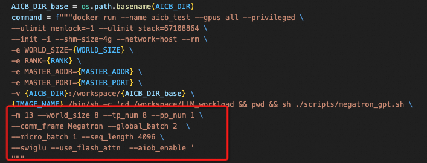
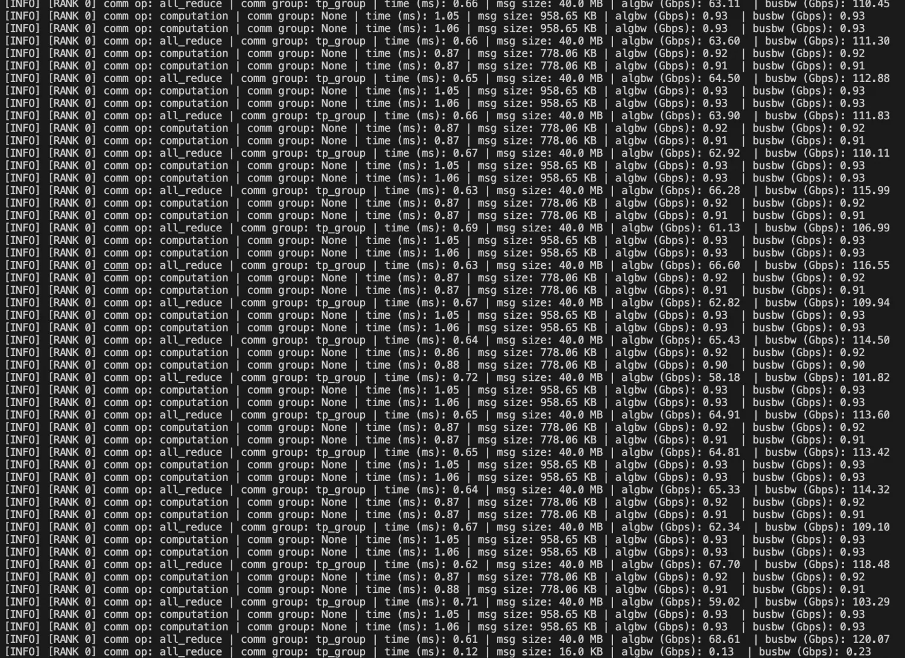
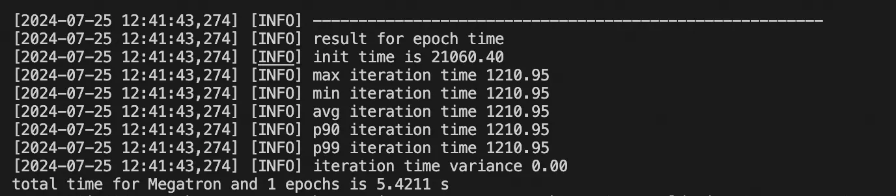
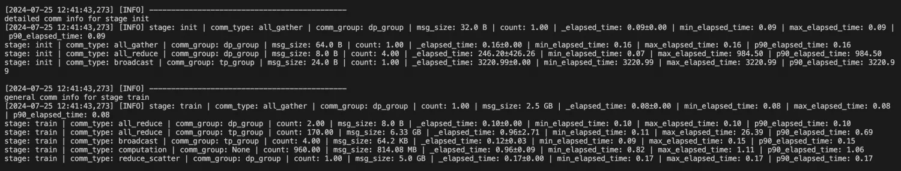
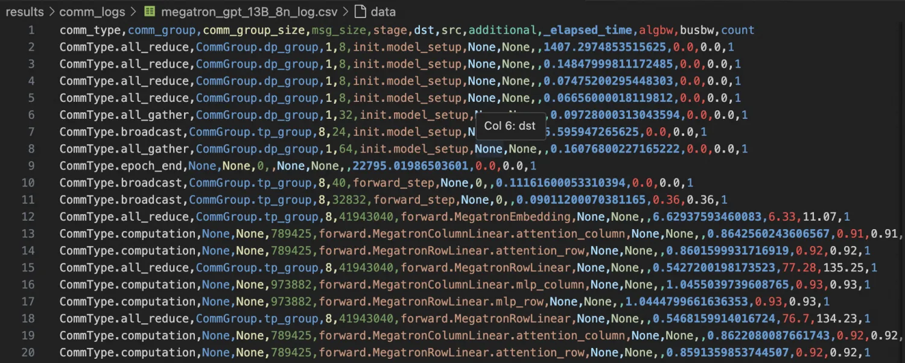
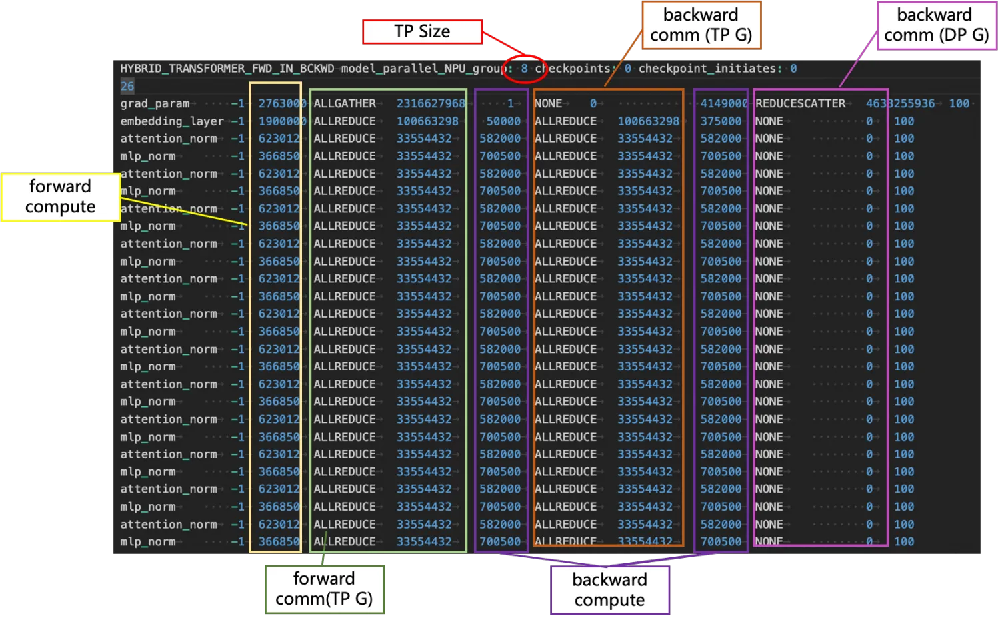
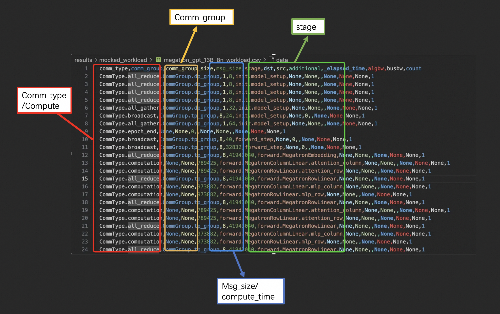

# Introduction
AI Communication Benchmark is a specialized communication benchmarking suite designed for artificial intelligence (AI) scenarios, primarily used to evaluate the performance of communication stacks. This suite not only provides detailed performance metrics but also assists developers in quickly identifying and diagnosing potential performance bottlenecks and issues within the communication stack. By simulating real-world communication traffic patterns during AI training and inference processes, this benchmark accurately reflects the communication stack's actual performance under conditions of high concurrency and large data transfer volumes. Whether it's inter-node communication in distributed computing or data synchronization in large-scale model training, this benchmarking suite offers effective performance evaluation and optimization recommendations to help users enhance overall system efficiency and stability.

# Environment Setup
Before setting up the environment, first pull the code repository to your local machine and then proceed with the environment configuration:
```
git clone https://github.com/aliyun/aicb.git
```
For the environment, if you are only generating workloads, no additional dependencies are needed. However, other functionalities require dependencies such as PyTorch, CUDA, NCCL, and NVIDIA APEX. Therefore, you can set up an appropriate runtime environment either by configuring your local environment or using Docker.
## Setting the environment using a Dockerfile.
```
docker build -t aicb:v0.0.1 .
docker run --gpus all --net host --shm-size 16g -it --rm aicb:v0.0.1 
```
## Setting the Environment Locally
For a local environment, you will need Python >= 3.8, CUDA Version >= 11.8, PyTorch >= 2.0.0, and NVIDIA APEX.
## Using Official Docker
You can also create the required Docker environment using [NGC's PyTorch container ](https://ngc.nvidia.com/catalog/containers/nvidia:pytorch), where pytorch:xx.xx should be >= pytorch:23.08.
```
docker pull nvcr.io/nvidia/pytorch:xx.xx-py3
docker run --gpus all -it --rm -v /path/to/AICBench:/workspace/AICBench nvcr.io/nvidia/pytorch:xx.xx-py3
```

# Basic Usage 
## Physical Execution
When running on a physical machine, additional configuration for PyTorch-related environment variables is required. This can be done by explicitly specifying them in a script or by adding the environment variables directly. The following table lists the required environment variables:

| Parameter Name  | Description                   |
|-----------------|-------------------------------|
| nnodes          | Number of nodes               |
| node_rank       | Rank number of the node       |
| nproc_per_node  | Number of GPUs per node       |
| master_addr     | Address of the master node    |


### Quick start for single-node execution
The script for running AICB on a physical machine is：[/scripts/megatron_workload_with_aiob.sh](../scripts/megatron_workload_with_aiob.sh)

We provide four pre-existing models (7/13/22/175/)B and moe to quickly launch and run on a physical machine, which can be specified using the parameter `--model_size`. Additionally, the Megatron parallel framework supports enabling the aiob_enable option to obtain the computation time for each operation of the actual model. Without using aiob, only fixed waiting times can be filled. Alternatively, when AIOB is enabled, you can specify `--comp_filepath` to fill in the corresponding computation time.
Below is an example of generating a Workload with a model size of 13B, tp 8, pp 1, a total GPU count of 8, gbs 2, mbs 1, sequence length of 4096, with flash_attn and swiglu enabled, and using AIOB to obtain the computation time for each operation of the actual model.
``` bash
export MASTER_ADDR=127.0.0.1
export MASTER_PORT=23089
export WORLD_SIZE=1
export RANK=0

sh ./scripts/megatron_gpt.sh \
-m 13 --world_size 8 --tensor_model_parallel_size 8 --pipeline_model_parallel 1 \
--frame Megatron --global_batch 2  \
--micro_batch 1 --seq_length 4096 \
--swiglu --use_flash_attn  --aiob_enable  
```
### Quick start for multi-node execution
The script used for multi-node execution is：[run_in_cluster.py](../scripts/run_in_cluster.py)

Steps：
1. First, install the batch distribution commands (such as pssh and pscp).
2. Edit the `iplist` file of the cluster to be used, adding an accessible IP address of each machine per line to the iplist.
3. Modify [run_in_cluster.py](../scripts/run_in_cluster.py) to specify the image name and paths to `iplist` file and AICB home directory. Please refer to the doc of [run_in_cluster.py](../scripts/run_in_cluster.py) for more details. 
4. Modify [run_suites.py](../run_suites.py) to select the workload to run (default: no workload).
5. Copy the `iplist` and AICB source code to each machine (e.g., using pscp).
4. Run the command just like this: `pssh -i -h /path/to/iplist -o out -e err -t 0 "cd /path/to/aicb && python run_in_cluster.py"`. Remember to replace `/path/to/iplist` and `/path/to/aicb` with the actual path on your machine.

The specific command to be run on each machine can be modified in the highlighted section:


### Logs and Results
After each communication is completed, the program will print the relevant logs for this communication. The output format is as follows and contains almost all the information about the communication operation:
* communication type
* communication group
* Message size
* Communication execution time
* [Throughput](https://github.com/NVIDIA/nccl-tests/blob/master/doc/PERFORMANCE.md)



After all communications are completed, information about the use case will be summarized.
* This includes the overall runtime and an analysis of the time for each iteration, allowing for a clear view of whether each iteration runs normally and if there are any jitters.

* Time for each communication type
First, distinguish between the model training phases: the init phase and the train phase. Then, summarize the collective communications performed in each phase, including their corresponding message sizes, frequencies, and specific average latencies, maximum and minimum values, etc. This helps to pinpoint which type of collective communication operation in which message segment is causing anomalies, facilitating further investigation and troubleshooting.

#### File outputs
The file outputs include two different types of files: .csv file.
1. The CSV files are saved in:
`results/comm_logs/megatron_gpt_13B_8n_log.csv`,And you can also see the execution time, the execution phase, as well as the algorithmic bandwidth (algbw) and bus bandwidth (busbw) belonging to different comm_group and different comm_type.It also includes the computation time for each part of the model and the computation phase it belongs to.



Inaddition to the aforementioned details, a .csv file is provided for detailed analysis of the results. Here’s how to work with it:
    1. Reading _workload.csv Log:
      * You can read the _workload.csv log file by invoking log_analyzer.log.Workload.load(filename).
      * This will return Workload and args.
        * args contains the parameters used for training input.
        * Workload consists of the generated intermediate results.
    2. Reading _log.csv Log:
    * You can read the _log.csv log file by invoking log_analyzer.log.Log.load(filename).
    * This will return a Log object, containing:
      * comm_logs: List[LogItem]: This is a list of all generated logs.
      * epoch_times: List[int]: This lists the time taken for each iteration. The first iteration typically represents initialization, which might show different communication behavior compared to subsequent iterations, potentially leading to differences in time.
      * comm_log_each_epoch: List[List[LogItem]]: This is a list where each item corresponds to the communication logs for each iteration. If one iteration has a significantly different time compared to others, you can analyze this specific iteration to identify the communication causing the discrepancy.
By leveraging these log files and parsing methods, you can perform a thorough and detailed analysis of the training process, identifying any abnormalities or areas for optimization.
## Generate Workload for Simulation(SimAI)
### Quick start
AICB's script for generating Workload is: `./scripts/megatron_workload_with_aiob.sh`
We provide four pre-existing models (7/13/22/175)B to quickly generate the corresponding Workload, which can be specified using the parameter `--model_size`.The computation part of the model can be selected to use aiob via--aiob_enableWhen not using aiob, the default fixed time is used to fill the Workload.When `--aiob_enable` is enabled, if `--comp_filepath` is not specified, the current GPU's computation time will be used to fill the Workload
Below is an example of generating a Workload with a model size of 7B, tp 4, pp 1, a total GPU count of 4096, gbs 8192, mbs 1, sequence length of 4096, with flash_attn, swiglu, and aiob enabled, and reading Example.txt as the computation time.
```bash
sh ./scripts/megatron_workload_with_aiob.sh -m 7 \
--world_size 4096 --tensor_model_parallel_size 4 --pipeline_model_parallel 1 \
--frame Megatron --global_batch 8192 \
--micro_batch 1 --seq_length 4096 --swiglu \
--use_flash_attn  --aiob_enable \
--comp_filepath workload/aiob_inputs/Example.txt
```
### Workload
The generated Workload result is saved in:`results/workload/gpt_7B-world_size4096-tp4-pp1-gbs8192-mbs1-seq4096-flash_attn-True.txt`


## Run AICB with customized cases
In addition to the quick start options, you can also customize the model parameters in detail to run on physical machines or generate the required workloads for simulation and analysis. This flexibility allows you to tailor the workloads specifically to your needs, whether you are experimenting with different configurations of large language models, testing various parallel frameworks, or optimizing your runtime environment. Customizing parameters provides deeper insights and greater control over the benchmarking and simulation processes, enabling more precise performance tuning and analysis.

### Parameters
The main parameters for AICB are as follows: 

| Category                     | Parameter Name                   | Description                                                                 | 
|------------------------------|-----------------------------------|-----------------------------------------------------------------------------|
| Name                         | frame                             | DeepSpeed/Megatron                                                          |
|                              | model_name                        | Llama/GPT/...                                                               |
|Training Parameters           | world_size                        | Total number of GPUs                                                        |
|                              | global_batch                      | Total batch size for training                                               |
|                              | micro_batch                       | Batch size per model instance (local batch size).                           |
|                              | epoch_num                         | Number of iterations                                                        |
| Model parameters             | model_size                        | Model size (7/13/65/175/270)B and moe                                       |
|                              | num_layers                        | Number of transformer layers.                                               |
|                              | hidden_size                       | Transformer hidden size.                                                    |
|                              | num_attention_heads               | Number of transformer attention heads.                                      |
|                              | seq_length                        | Maximum sequence length to process.                                         |
|                              | vocab_size                        | Size of vocab before EOD or padding.                                        |
|                              | max_position_embeddings           | Maximum number of position embeddings to use.                               |
|                              | ffn_hidden_size                   | Transformer Feed-Forward Network hidden size.                               |
| Megatron parallel parameters | tensor_model_parallel_size        | Degree of tensor model parallelism.                                         |
|                              | pipeline_model_parallel           | Degree of pipeline model parallelism.                                       |
|                              | enable_sequence_parallel          | Enable sequence parallel optimization.                                      |
| Megatron optimization parameters | use_flash_attn                | Use FlashAttention implementation of attention.                             |
|                              | swiglu                            | Use gated linear units and SiLU activation instead of default gelu          |
|                              | openai_gelu                       | Use OpenAI's GeLU implementation.                                           |
|                              | onnx_safe                         | Use workarounds for known problems with Torch ONNX exporter                 |
|                              | squared_relu                      | Use squared relu activation instead of default gelu                         |
|                              | bias_gelu_fusion                  | Enable bias and gelu fusion.                                                |
|                              | gated_linear_unit                 | Enable when use swiglu                                                      |
| MoE                          | expert_model_parallel_size        | Degree of expert model parallelism                                          |
|                              | moe_enable                        | Enable MoE                                                                  |
|                              | num_experts                       | Number of Experts in MoE (None means no MoE)                                |
|                              | moe_router_topk                   | Number of experts to route to for each token.                               |
|                              | moe_grouped_gemm                  | When there are multiple experts per rank, compress multiple local (potentially small) gemms in a single kernel|
| DeepSpeed parameters         | zero_stage,reduce_bucket_size     | choose zero optimizer stage                                                 |
|                              | allgather_bucket_size             | Optimizes communication efficiency and memory usage during all-gather operations For stage 1/2 only                                                          |
|                              | prefetch_bucket_size, param_persistence_threshold, model_persistence_threshold, max_live_parameters | For stage 3 only. Control the number of prefetch parameters. Control the size of all_gather and reduce_scatter |
| Other                        | aiob_enable                       | Enable AIOB to obtain computation time                                      |
|                              | comp_filepath                     | Use aiob_lib to get operation compute time                                  |

### Running on physical GPU clusters
The current entry file for running custom cases is [aicb.py](../aicb.py). By using this file, you can flexibly choose more parameters for tuning.
```bash
# DeepSpeed Stage 2 Example
torchrun \
--nnodes ${WORLD_SIZE} \
--node_rank ${RANK} \
--nproc_per_node gpu \
--master_addr ${MASTER_ADDR} \
--master_port ${MASTER_PORT} \
./aicb.py --frame=DeepSpeed --stage=$stage \
--world_size=$((NNODES*8)) --global_batch=$global_batch --epoch_num=$epoch_num \
--num_layers=$num_layers --hidden_size=$hidden_size \
--ffn_hidden_size=$ffn_hidden_size --num_attention_heads=$attention_heads \
--reduce_bucket_size=$bucket_size --allgather_bucket_size=$bucket_size

# Megatron Example
torchrun \
--nnodes $WORLD_SIZE \
--node_rank $RANK \
--nproc_per_node gpu \
--master_addr $MASTER_ADDR \
--master_port $MASTER_PORT \
./aicb.py --frame=Megatron --world_size=$((WORLD_SIZE*8)) --tensor_model_parallel_size=$tensor_model_parallel_size \
  --micro_batch=$batch_size --global_batch=$((WORLD_SIZE*8*batch_size/tensor_model_parallel_size)) --epoch_num=$epoch_num --swiglu \
  --num_layers=$num_layers --hidden_size=$hidden_size --ffn_hidden_size=$ffn_hidden_size --num_attention_heads=$num_attention_heads \
  $sp_enable --seq_len=$seq_len --vocab_size=$vocab_size --aiob_enable=$enable 

# MoE Example
torchrun \
--nnodes $WORLD_SIZE \
--node_rank $RANK \
--nproc_per_node gpu \
--master_addr $MASTER_ADDR \
--master_port $MASTER_PORT \
./aicb.py --frame=Megatron --world_size=$((WORLD_SIZE*8)) --tensor_model_parallel_size=$tensor_model_parallel_size --expert_model_parallel_size=$expert_model_parallel_size \
--moe_enable=$moe_enable --num_experts=$num_experts --moe_router_topk=$moe_router_topk --moe_grouped_gemm=$moe_grouped_gemm \
  --micro_batch=$batch_size --global_batch=$((WORLD_SIZE*8*batch_size/tensor_model_parallel_size)) --epoch_num=$epoch_num --swiglu \
  --num_layers=$num_layers --hidden_size=$hidden_size --ffn_hidden_size=$ffn_hidden_size --num_attention_heads=$num_attention_heads \
  $sp_enable --seq_len=$seq_len --vocab_size=$vocab_size --aiob_enable=$enable 
```
### Generating Workloads
In AICB, the generation of Workloads is divided into two types: one is to generate Workloads that can be used for simulation and analysis, and the other is to generate general-purpose Workloads that contain detailed information about various communication and computation aspects.
By providing the detailed parameters of the model, you can generate a general-purpose Workload that includes detailed information about various communications and computations. The general-purpose workload allows you to analyze the model's computational and communication performance under different parameters, and customize the workload files for run-time tuning and optimization. This can be achieved by using the following files:
[generate_deepspeed_stage3_workload](../workload_generator/generate_deepspeed_stage3_workload.py),[generate_deepspeed_stage1_2_workload](../workload_generator/generate_deepspeed_stage1_2_workload.py),[generate_megatron_workload](../workload_generator/generate_megatron_workload.py)

Here is an example:
```bash
python -m workload_generator.AIOB_simAI_workload_generator \
  --model_name GPT-13B --frame=Megatron \
  --world_size=16 --tensor_model_parallel_size=2 --pipeline_model_parallel=1 --global_batch=16 \
  --micro_batch=1   --num_layers=40 --seq_length=2048 \
  --hidden_size=5120 --epoch_num=1 \
  --use-distributed-optimizer --num_attention_heads=40 \
  --aiob_enable --use_flash_attn --swiglu 
```
#### Workload Files
The generated Workload files are saved in the `results/mocked_workload` directory.
Here is an explanation of a the generated Workload file:


### Creating customized Models
AICB offers remarkable extensibility. In addition to supporting GPT and LLaMA series models, it also allows for the creation of workloads for custom model architectures. This flexibility means you can adapt AICB to generate and test communication and computation patterns for a wide variety of models, beyond the pre-configured options, making it an invaluable tool for benchmarking and optimizing diverse AI training frameworks.
Custom models can be built using the MockedParam and MockedModel base classes. For specific implementation details, you can refer to the existing MockedMegatron and MockedDeepSpeed implementations.

Here is an example of a DeepSpeed Llama model:
```
DeepspeedForCausalLM
      |
      v
+----------------------+
| Linear: embed_tokens |
+----------------------+
      |
      v
+--------------------------------------+
|            DeepspeedModel            |
| +----------------------------------+ |
| | Linear: embed_tokens             | |
| +----------------------------------+ |
| | DeepspeedDecoderLayer x N        | |
| +----------------------------------+ |
| | Linear: norm                     | |
+--------------------------------------+
      |
      v
+--------------------------------------------------+
|              DeepspeedDecoderLayer               |
| +----------------------------------------------+ |
| | Linear: input_layernorm                      | |
| +----------------------------------------------+ |
| | DeepspeedAttention                           | |
| |  +----------------------------------------+  | |
| |  | Linear: q_proj                         |  | |
| |  | Linear: k_proj                         |  | |
| |  | Linear: v_proj                         |  | |
| |  | Linear: o_proj                         |  | |
| |  +----------------------------------------+  | |
| +----------------------------------------------+ |
| | Linear: post_attn_norm                      | |
| +----------------------------------------------+ |
| | DeepspeedMLP                                | |
| |  +----------------------------------------+  | |
| |  | Linear: gate_proj                       |  | |
| |  | Linear: down_proj                       |  | |
| |  | Linear: up_proj                         |  | |
| |  +----------------------------------------+  | |
+--------------------------------------------------+
      |
      v
+----------------------+
| Linear: lm_head      |
+----------------------+

```

Besides Model, you alse need to mocked the entire training process. The training process for all frameworks is abstracted into the following steps: `init, forward, backward, and step` (excluding pipeline parallelism). We need to further elaborate on the communications that occur in each step with workload items.
In the code, each workload primarily consists of three components:
1. Communication Information:
   This primarily includes information related to collective communication activities such as `comm_type, comm_group, comm_group_size, and msg_size`.
2. Additional Information:
   This includes supplementary information, such as the source node for broadcast communications and the time for compute operations.
3. Runtime Information:
   This mainly consists of runtime-specific details like `elapsed_time, algo_bw, and bus_bw` which indicate the actual performance and state of the collective communication activities.
Here is a brief example of training process and workload item:
```python
trainer.init()
for _ in range(epoch_num):
    if pipeline_model_parallel > 1:
        trainer.with_pipeline_forward_backward()
    else:
        for _ in range(num_microbatches):
            trainer.forward()
            trainer.backward()
    trainer.step()
workload.append({
    "operation": "init",             # Corresponds to one of init, forward, backward, step
    "comm_type": CommType.broadcast, # The type of communication
    "call_func": "_broadcast_model", # The function invoked in the source code
    "msg_size": param.msg_size(),    # The size of the communication message
    "comm_group": CommGroup.dp_group,# The communication group
    "src": 0,                        # Optional: Only for broadcast, specifies the source node
    "additional": send_next          # Optional: Specifies the corresponding operation in pipeline parallelism
})
```

# Troubleshooting & FAQs
N/A

